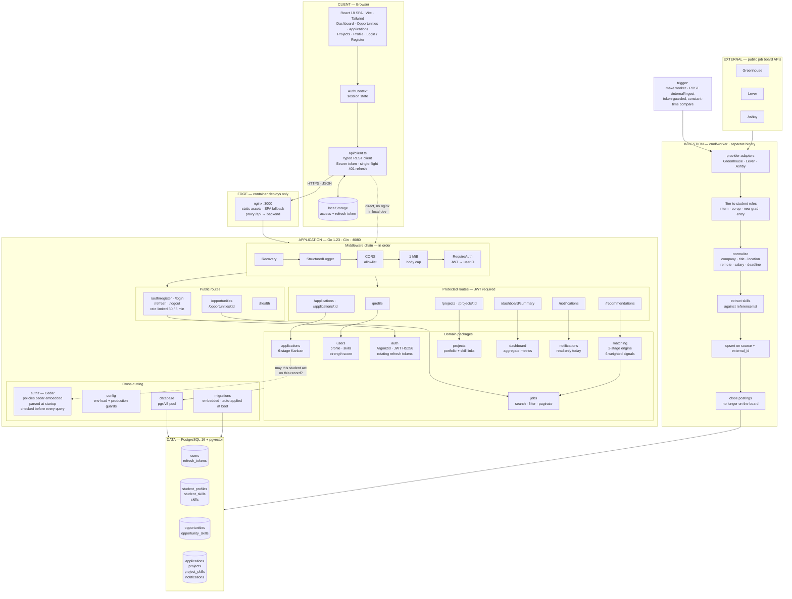
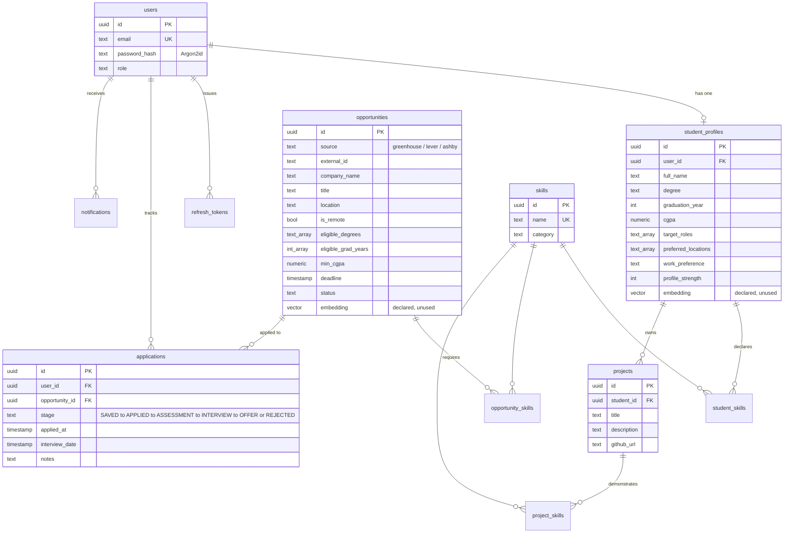

# StudentOS

> **One platform to discover opportunities, track applications, and build your career.**

StudentOS is a personal opportunity discovery and career management platform for college
students. It replaces fragmented internship hunting across LinkedIn, campus portals, and
WhatsApp groups with a single system that pulls real openings from company job boards,
scores them against your profile, and tells you *why* each one fits.

---

## The Problem

Students waste hours every week:

- Scrolling through irrelevant job postings on multiple platforms
- Losing track of applications across email, spreadsheets, and bookmarks
- Missing deadlines because there's no central place to manage the pipeline
- Not understanding _why_ certain opportunities are a good fit

## What StudentOS Does

| Feature | What it does |
|---|---|
| **Smart Profile** | Academic record, skills, target roles, location and work preferences, with a profile strength score that shows what's still missing |
| **Opportunity Discovery** | Real internships and jobs pulled automatically from Greenhouse, Lever, and Ashby company boards — deduplicated, normalized, and filtered to student-appropriate roles |
| **Explainable Matching** | Every opening is scored against your profile, with a transparent breakdown of which signals matched and which requirements you don't meet yet |
| **Application Tracker** | Kanban pipeline: Saved → Applied → Assessment → Interview → Offer / Rejected, with interview dates, follow-up reminders, and per-application notes |
| **Project Portfolio** | Record your projects and link them to skills — project-validated skills feed directly back into your match scores |
| **Command Center** | Dashboard showing active applications, upcoming interviews, and deadlines closing within the week |

---

## Features in Detail

### Opportunity Discovery

An ingestion worker fetches live postings directly from public company job boards:

- **Sources**: Greenhouse, Lever, and Ashby board APIs
- **Filtering**: keeps intern, co-op, new-grad and entry-level roles; discards senior postings
- **Normalization**: company, title, location, remote flag, salary and deadline are mapped into one consistent shape regardless of source
- **Skill extraction**: requirements are matched against a reference skill list and stored as structured tags, not free text
- **Deduplication**: postings upsert on their source ID, so re-running the worker updates rather than duplicates
- **Stale closing**: postings that disappear from a board are automatically marked closed

Run it on demand:

```bash
make worker
```

### Explainable Matching

Every opportunity is scored against your profile using a transparent, deterministic
formula — no black box, no "trust the algorithm."

**Stage 1 — hard filters.** Closed postings, passed deadlines, roles you've already
applied to, and degree or graduation-year mismatches are removed outright.

**Stage 2 — weighted scoring:**

| Signal | Weight | What it measures |
|---|---|---|
| Skill Match | 40% | Overlap between your skills and the opportunity's requirements |
| Role Fit | 20% | Fuzzy match against your target roles |
| Eligibility | 15% | Degree, graduation year, CGPA compatibility |
| Location | 10% | Match against your preferred locations and remote preference |
| Project Relevance | 5% | Skills demonstrated in your portfolio projects |
| Semantic | 10% | _Not yet implemented_ — redistributed across the signals above |

Each result carries its own reasoning: verified positive signals ("Verified skill: Python",
"Meets CGPA requirement (8.2 >= 7.5)") alongside a gap analysis ("Docker required but not
in profile"). You always know why something ranked where it did, and what would move it up.

### Application Tracking

Save an opportunity and it enters your pipeline. Move it through six stages, attach
interview dates and notes, and the dashboard keeps count of what's active, what's coming
up, and which saved postings are about to expire.

### Portfolio

Projects aren't decoration — each one links to the skills it demonstrates, and those
skills feed the matching engine. Adding a project that uses React measurably raises your
score against every React opening.

---

## Tech Stack

| Layer | Technology |
|---|---|
| Frontend | React 18, TypeScript, Vite 5, Tailwind CSS |
| Backend | Go 1.23, Gin, pgx/v5 |
| Database | PostgreSQL 16 (+ pgvector extension, schema-ready) |
| Authentication | Argon2id password hashing, JWT access tokens, rotating refresh tokens |
| Authorization | [Cedar](https://www.cedarpolicy.com/) policy engine (`cedar-go`) |
| Containers | Docker / Finch Compose |

---

## System Architecture

StudentOS is a three-tier application with one detached background worker. Two binaries
are built from a single Go module: the API server and the ingestion worker. They share
every internal package — the same models, the same database layer — but run independently,
so ingestion can never stall a student's request.



> The diagram renders on GitHub. Solid arrows are the request path; dotted arrows are
> conditional or alternative paths.

### Data model

`skills` is shared reference data — the same rows are joined by students, opportunities,
and projects, which is what makes "your project skill matched this requirement" a simple
join rather than string comparison. Every foreign key cascades on delete, so removing an
account leaves nothing orphaned.



`uq_source_external` on `opportunities` is what makes ingestion idempotent — re-running the
worker updates existing postings instead of duplicating them. `uq_user_opportunity` on
`applications` is what lets "save" and "apply" be the same upsert.

### How a request flows

1. The SPA attaches its access token and calls `/api/v1/...`.
2. Gin runs the middleware chain. Unauthenticated routes (`/auth/*`, opportunity browsing) skip `RequireAuth`; everything else resolves the JWT into a user ID on the request context.
3. The handler asks Cedar whether this student may act on this record, where ownership applies.
4. The query runs through the pgx pool — always parameterized, always scoped by owner.
5. On a `401`, the client silently rotates its refresh token and replays the original request once. Concurrent 401s share a single refresh call, so a page firing four requests at once produces one rotation, not four.

### How a match is computed

When a student opens Opportunities, `GET /recommendations` runs a two-stage pipeline:

```
  ONE query loads the candidate profile
  (degree · grad year · CGPA · skills · project skills
   · target roles · locations · already-applied IDs)
                    │
                    ▼
  ┌─────────────────────────────────────────┐
  │  STAGE 1 — deterministic hard filters   │
  │  drop: inactive · past deadline          │
  │        already applied · degree mismatch │
  │        graduation-year mismatch          │
  └────────────────┬────────────────────────┘
                   │  survivors only
                   ▼
  ┌─────────────────────────────────────────┐
  │  STAGE 2 — weighted signal scoring      │
  │  skill 40 · role 20 · eligibility 15    │
  │  location 10 · project 5 · semantic 10  │
  │  each signal appends its own reason     │
  └────────────────┬────────────────────────┘
                   │
                   ▼
    sorted by score, returned with
    matched_reasons + missing_requirements
```

Stage 1 is a hard gate, not a penalty — an ineligible posting is removed rather than
ranked low, so a student never sees a role they cannot apply for. Stage 2 never reduces a
score to a bare number: every signal that fires appends the sentence explaining it, which
is what the "Why you match" panel renders.

### How authentication works

```
  register / login
        │
        ├── password → Argon2id (64 MB, 3 iterations, bounded concurrency)
        │
        └── issues a token PAIR:
              access token   JWT HS256, 15 minutes, stateless
              refresh token  opaque UUID, 7 days, SHA-256 hashed in the DB

  refresh  →  old token revoked, new pair issued, in one transaction
  logout   →  refresh token revoked
```

Refresh tokens are single-use: rotating one immediately revokes it. Only the hash is
stored, so a database leak does not yield usable tokens.

### Authorization: two layers, on purpose

Ownership is enforced twice. The Cedar policy in
[`backend/internal/authz/policies.cedar`](backend/internal/authz/policies.cedar) states the
rule in one readable, testable place and is checked *before* the query. The SQL predicate
`AND user_id = $n` is deliberately kept underneath it. If a handler ever forgets to ask
Cedar, the database still refuses. Cedar is the auditable statement of intent; SQL is the
backstop.

Denials return `404`, not `403` — confirming that another student's record exists is itself
a leak.

---

## Quick Start

### Prerequisites

- Docker + Docker Compose (or [Finch](https://github.com/runfinch/finch))
- Git

```bash
git clone https://github.com/shubZk17/student-os.git
cd student-os
cp .env.example .env
docker compose up -d          # or: finch compose up -d

curl http://localhost:8080/health
# → {"status":"healthy","database":"connected"}
```

Open [http://localhost:3000](http://localhost:3000) and register an account.

> **Note:** the container path is written but has not been run end to end — no container
> runtime was available on the development machine. If it fails, the local path below is
> the one that is known to work.

| Service | URL |
|---|---|
| Frontend | http://localhost:3000 |
| Backend API | http://localhost:8080 |
| Health check | http://localhost:8080/health |
| PostgreSQL | localhost:5432 |

### Load Demo Data

```bash
make seed-dev       # sample opportunities, so the app isn't empty on first run
```

### Pull Real Opportunities

```bash
make worker         # fetches live postings from Greenhouse, Lever and Ashby
```

---

## Local Development (No Containers)

```bash
# Terminal 1 — PostgreSQL only
make docker-up

# Terminal 2 — Backend (migrations apply automatically on boot)
cd backend && go run cmd/server/main.go

# Terminal 3 — Frontend with hot reload
cd frontend && npm install && npm run dev
```

Frontend runs at http://localhost:5173 and proxies the API to http://localhost:8080.

---

## API

All routes are prefixed `/api/v1`. Protected routes take `Authorization: Bearer <token>`.

| Method | Route | Auth | Purpose |
|---|---|---|---|
| POST | `/auth/register` | — | Create an account (also creates the profile) |
| POST | `/auth/login` | — | Exchange credentials for a token pair |
| POST | `/auth/refresh` | — | Rotate a refresh token |
| POST | `/auth/logout` | — | Revoke a refresh token |
| GET | `/opportunities` | — | Search, filter and paginate openings |
| GET | `/opportunities/:id` | — | Single opportunity detail |
| GET | `/recommendations` | ✓ | Ranked, explained matches for you |
| GET · PUT | `/profile` | ✓ | Read / update profile and skills |
| GET · POST | `/applications` | ✓ | List / add to the tracker |
| PATCH · DELETE | `/applications/:id` | ✓ | Move stage / remove |
| GET · POST | `/projects` | ✓ | List / create portfolio projects |
| DELETE | `/projects/:id` | ✓ | Remove a project |
| GET | `/notifications` | ✓ | List notifications and unread count |
| PATCH | `/notifications/:id/read` | ✓ | Mark one read |
| GET | `/dashboard/summary` | ✓ | Command-center metrics |

### Security

Authentication and the two authorization layers are described under
[System Architecture](#system-architecture). Beyond those:

- Every query is parameterized; every student-owned record is scoped by owner in SQL
- Rate limiting on credential routes (30 attempts / 5 minutes), sized so a shared campus NAT IP isn't locked out by normal use
- Strict CORS allowlist, 1 MiB request body cap, and trusted-proxy handling that never reads a forgeable `X-Forwarded-For`
- Production config validation refuses to boot with a development JWT secret, a blank database password, `sslmode=disable`, or `ALLOWED_ORIGINS=*`
- The internal ingestion route is not registered at all unless its shared secret is configured, and compares it in constant time

---

## Project Structure

```text
student-os/
├── docker-compose.yml        # Full local stack
├── Makefile                  # Developer commands
├── .env.example              # Environment variables (no secrets)
├── seeds/dev_seed.sql        # Demo data (dev only)
├── backend/
│   ├── cmd/
│   │   ├── server/           # API server entrypoint
│   │   └── worker/           # Ingestion worker entrypoint
│   ├── internal/
│   │   ├── auth/             # Argon2id, JWT, auth handlers
│   │   ├── authz/            # Cedar authorization policy
│   │   ├── users/            # Student profiles & skills
│   │   ├── jobs/             # Opportunities & job-board adapters
│   │   ├── matching/         # Explainable matching engine
│   │   ├── applications/     # Kanban application tracking
│   │   ├── projects/         # Portfolio & project skills
│   │   ├── ingest/           # Job-board ingestion (CLI + API)
│   │   ├── notifications/    # In-app notifications
│   │   ├── dashboard/        # Command-center metrics
│   │   ├── database/         # Connection pooling
│   │   └── middleware/       # Auth, CORS, rate-limiting, logging
│   └── migrations/           # Embedded SQL migrations (auto-applied)
└── frontend/
    ├── nginx.conf            # SPA routing + API proxy
    └── src/
        ├── api/              # Typed REST client
        ├── components/       # UI components & layouts
        ├── context/          # Auth context provider
        ├── pages/            # Dashboard, Opportunities, Applications, Projects, Profile
        └── types/            # TypeScript data models
```

---

## Current Limitations

An honest list of what is **not** true of this system today:

- **Semantic / vector matching is not implemented.** The schema declares `vector(384)` columns and the pgvector extension, but no code generates, stores, or queries embeddings. The 10% semantic weight is redistributed across the deterministic signals.
- **No file uploads.** `resume_url` and `portfolio_url` are text fields for links you type in.
- **Job ingestion is on-demand, not scheduled.** The ingestion code works and is run manually (`make worker`) or through an authenticated internal route; nothing triggers it on a timer yet.
- **Notifications have no producer.** The table, the API and the bell UI all work, but nothing in the codebase ever inserts a notification, so the bell is empty.
- **Interview scheduling is minimal.** An application carries an `interview_date` field, but there is no calendar integration.

---

## Testing

```bash
make test                          # backend unit tests
cd frontend && npm run build       # type-check and production build
```

Both run in CI on every push — see `.github/workflows/ci.yml`.

---

## Deployment

The canonical environment is local. Optional deployment configs are included:

| Platform | Config | Status |
|---|---|---|
| Vercel (frontend) | `frontend/vercel.json` | Live — https://student-os-go-solo1.vercel.app |
| Render (frontend + API + Postgres) | `render.yaml` | Live — API sleeps when idle |

`amplify.yml` and `backend/apprunner.yaml` are historical artifacts of a cloud migration
that was planned but never deployed.

---

## License

Apache-2.0 or MIT License.
